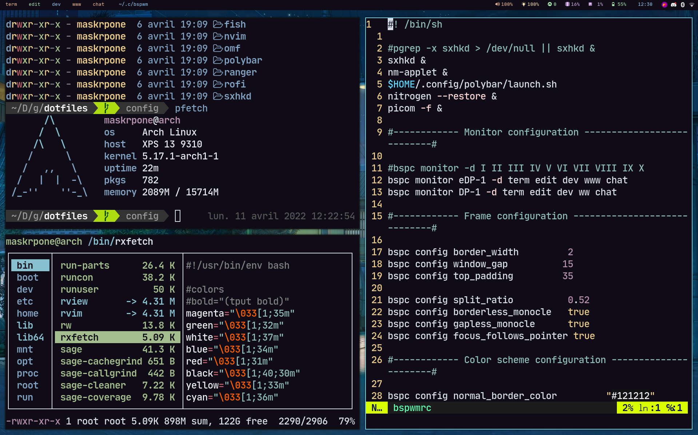

# Here are my dotfiles
#### The global theme used is [catppuccin](https://github.com/catppuccin/catppuccin), with the default background purple replaced with `#0f0c17` .

 **Showcase**

![[rice_terminal.png]]

 * shell : [fish](https://github.com/fish-shell/fish-shell)with [oh-my-fish](https://github.com/oh-my-fish/oh-my-fish)
 * oh-my-fish plugins :  [bobthefish](https://github.com/oh-my-fish/theme-bobthefish) (theme), [z](https://github.com/oh-my-fish/plugin-z)
 * the ls command has been replaced (purely for the look of it) by [exa](https://github.com/ogham/exa) (the exact command for this display is : `exa -l --icons`)
 * fetching tool : [pfetch](https://github.com/dylanaraps/pfetch)
 * file explorer : [ranger](https://github.com/ranger/ranger)
 * text editor : [neovim](https://github.com/neovim/neovim), with [vim-plug](https://github.com/junegunn/vim-plug)
 - Terminal :  [Alacritty](https://github.com/alacritty/alacritty), you'll find the color scheme of it in the `alacritty.yml` file, in config/alacritty/
 
*The shortcuts defined for terminal tasks are in the `config.fish` file, in config/fish*

![[rice_lock.png]]

- Lockscreen : a fork of [i3lock-fancy](https://github.com/meskarune/i3lock-fancy), available at downloading usin `yay -S i3lock-fancy-git`

*Please take note that it is a pretty slow lockscreen, go look at [i3lock-fancy-rapid](https://github.com/yvbbrjdr/i3lock-fancy-rapid) for a faster implementation*

![[rice_rofi.png]]

- taskbar : [polybar](https://github.com/polybar/polybar), if you don't know where to start for customizing it, go check this [video](https://www.youtube.com/watch?v=cLB008-FJ5o)
- application-menu : [rofi](https://github.com/davatorium/rofi), theme of it is [catppuccin](https://github.com/catppuccin/catppuccin) , with the `#0f0c17` purple instead of the default background one
- icons : [tela circle](https://github.com/vinceliuice/Tela-circle-icon-theme)

### Wallpaper

![[wallpaper.jpg]]

#### Hope there is all you need to know
If not, you can find me (Maskrpone, on the unixporn discord channel) on Discord.
